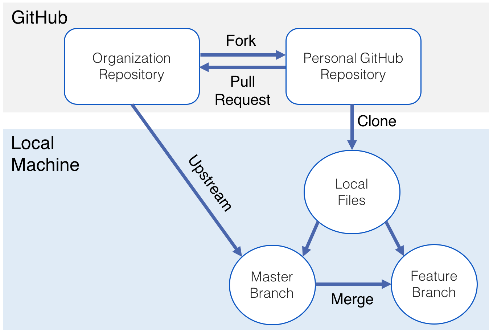

## Work-flow for a new feature



**1. Move Trello card to "In Progress."**  
**2. Pull from organization/upstream repo (threeamigospizza) to local master**
```sh
$ git checkout master  # Ensure you are on master branch
$ git pull upstream master  # Update local master
```
**3. Create branch and check it out**
 ```sh
$ git checkout -b [new_feature]
 # OR
$ git branch [new_feature]
$ git checkout [new_feature]
 ```
**4. Add, commit, push new changes to origin**  
You are in the feature branch, right?  
**5. Pull most recent files from upstream repo to local master again**
```sh
$ git checkout master
$ git pull upstream master
```
**6. Merge master branch into the new feature branch** 
If there are any conflicts between the new feature and the project overall, deal with them now *in the feature branch.*
```sh
$ git checkout [new_feature]
$ git merge master
```
**7. Push feature branch to your github repo**
```sh
$ git push origin [new_feature]
```
**8. Make pull request to the Organization Repo.**  
**9. Move Trello card to "fixed."**
New feature is now ready for review.

## Heroku CLI
**Deploy code to a heroku app that is setup as a remote from a feature branch**  
*Code in feature branch that is not pushed to origin will not be pushed to heroku-remote.*
```sh
$ git push [heroku-remote-name] [branch-name]:master
```
**Open app in browser**
```sh
$ heroku open -r [heroku-remote-name]
```
**See all remotes**  
Should have at least upstream and origin.  Heroku remotes listed as well.
```sh
$ git remote -v  
```
**Create new Heroku app**
```sh
$ heroku create  # Make sure you don't already have a remote named heroku!
```
**Deploy code to app from local master**  
Master should be clean, so this will deploy the current production app.
```sh
git push heroku master
```
